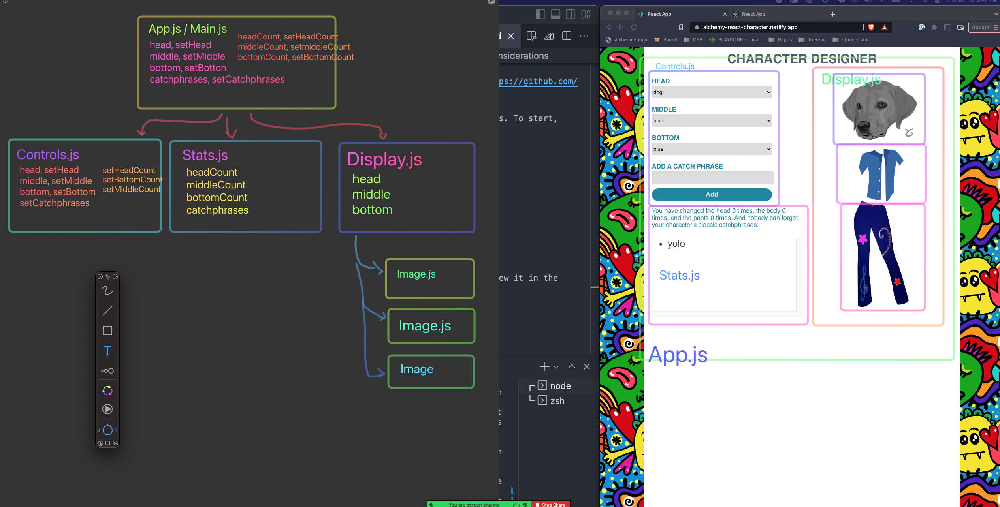

# From Scratch Plan

- Step 1 - add head, setHead state and get the head displaying / changing
- Step 2 - add middle, setMiddle state and get the middle displaying / changing
- Step 3 - add bottom, setBottom state and get the bottom displaying / changing
- Step 4 - add counts (one at a time)
- Step 5 - add catchphrases
